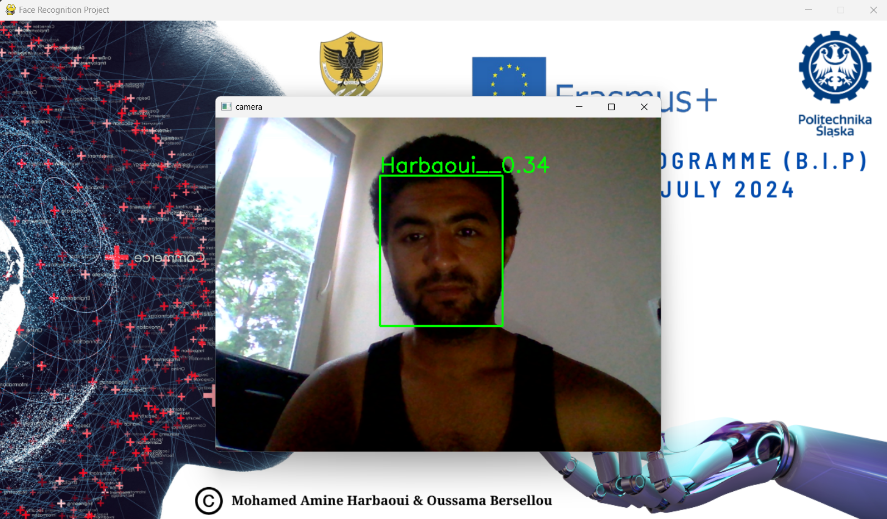

# BIP L'AQUILA 2024 

# Face Recognition based on MTCNN and Facenet

This project aims to develop a face recognition application using the MTCNN and Facenet libraries. 
MTCNN is used to detect faces in images, while Facenet is used to encode the detected faces into a unique vector that can be compared to other vectors for performing face recognition.

## Prerequisites

Before you can run this project, you must have Python 3.10 and the following packages installed:
```
tensorflow
mtcnn
keras
opencv
scikit-learn
```
## Execution
you can run the main file main.py using the following command:
```
python main.py
```
The application will start and you will be able to start using the Facial recognition system by adding images of people to the database.


## Internal functioning

When the application starts, it uses MTCNN to detect faces. The detected faces are then encoded using Facenet to produce a unique vector that represents each person.

When an image is submitted for face recognition, the same face detection and encoding process is performed on the submitted image. The resulting vector is then compared to each vector in the face recognition database to find the closest face.



## Conclusion

This project shows you how to use the MTCNN and Facenet libraries to develop a simple face recognition application. You can use this code as a base to build a more complex application or adapt it to your needs.


#### by: 
```
  1. Mohamed Amine Harbaoui
  2. Oussama Bersellou
```
